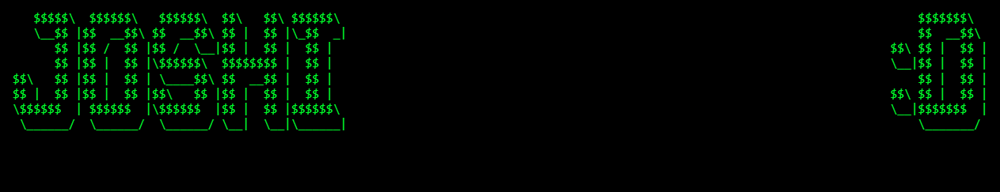

## ABOUT ME :D

<h3> GENERAL INFOS </h3>

  My name is Josh and im from germany  
  I started coding when i was 10

<h3> PROGRAMMING PATH </h3>

  -> started with html/css/js (2 years)  
  -> switched to c# to make games (2 years)  
  -> switched to python cause c# got boring and python has many cool libaries :D (now)  
  -> learning godot (now)

