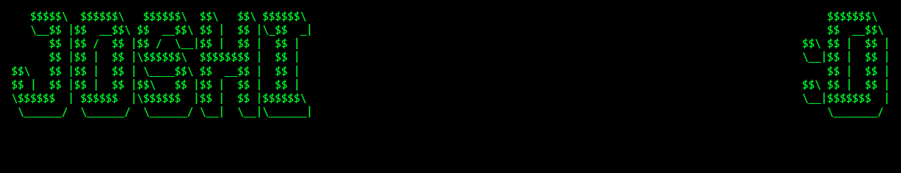
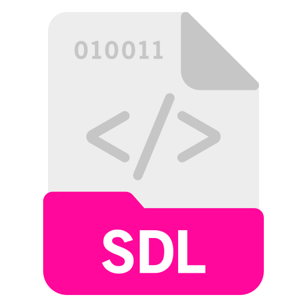

##

## ABOUT ME :D

<h3> GENERAL INFOS </h3>

  My name is Josh and im from germany  
  I started coding when I was 10

<h3> PROGRAMMING PATH </h3>

  -> started with html/css/js (2 years)  
  -> switched to c# to make games (2 years)  
  -> switched to python cause c# got boring and python has many cool libaries :D (1 year)  
  -> switched to c++ (final switch i swear) to learn 3d graphics at it core with opengl & sdl3 (now)  
  -> learning opengl & sdl3 (now)

## frontend

## backend

## libaries

  
  

